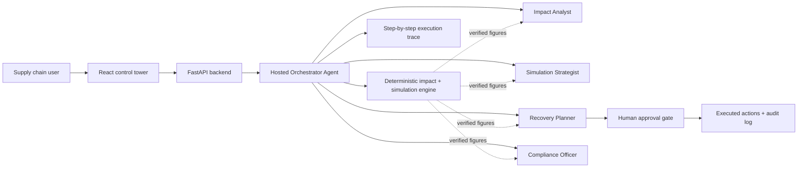
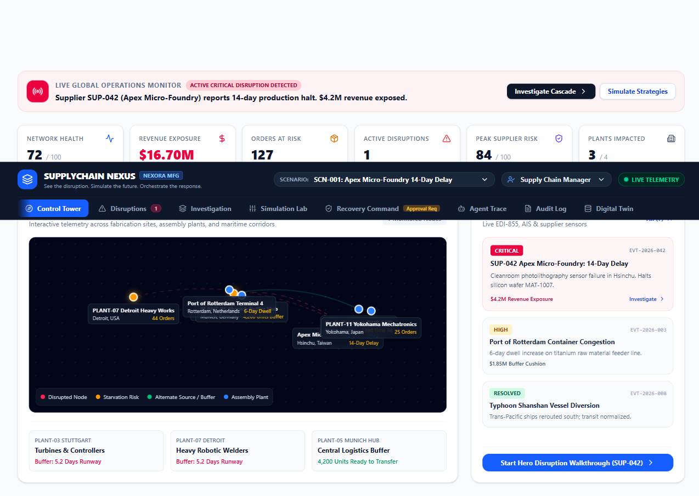
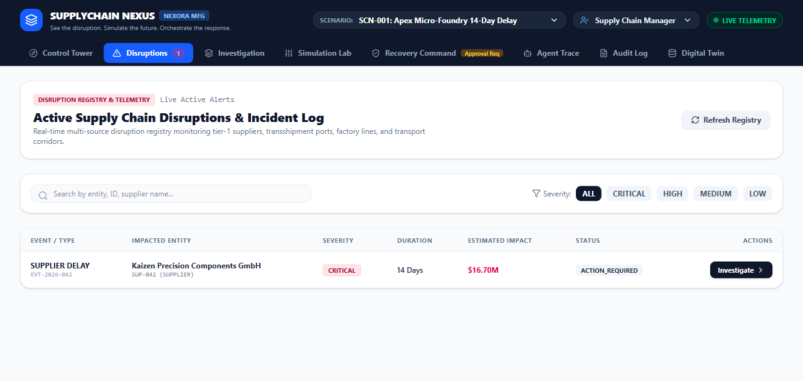
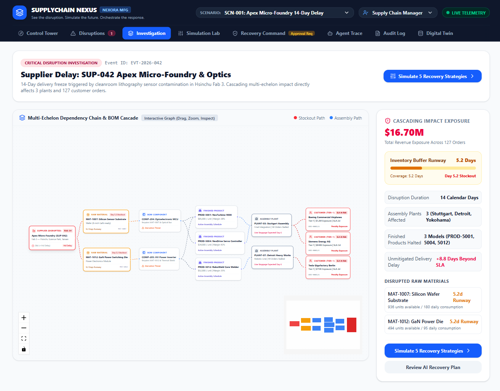
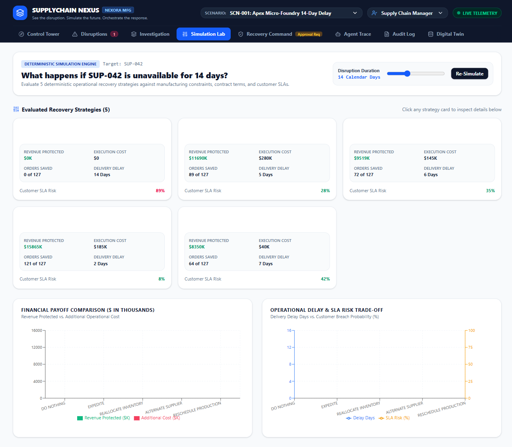
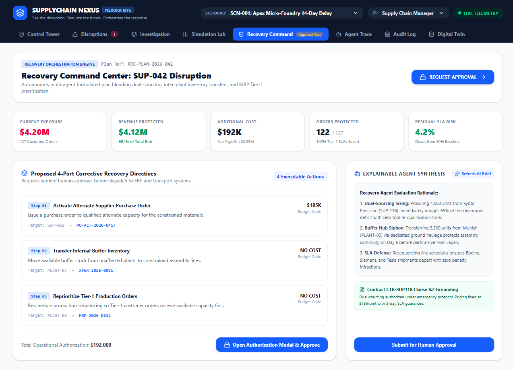
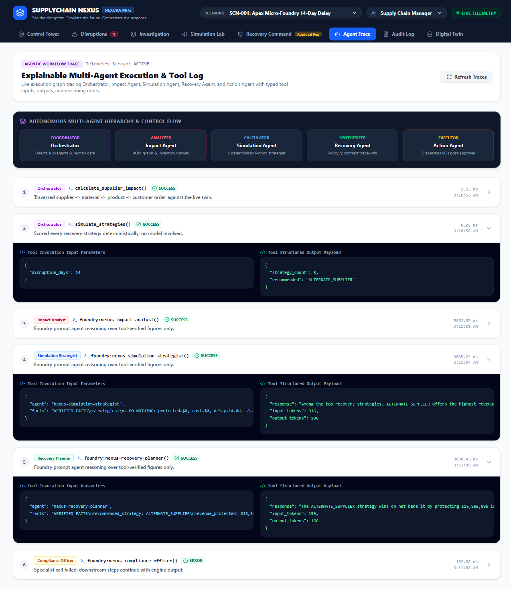
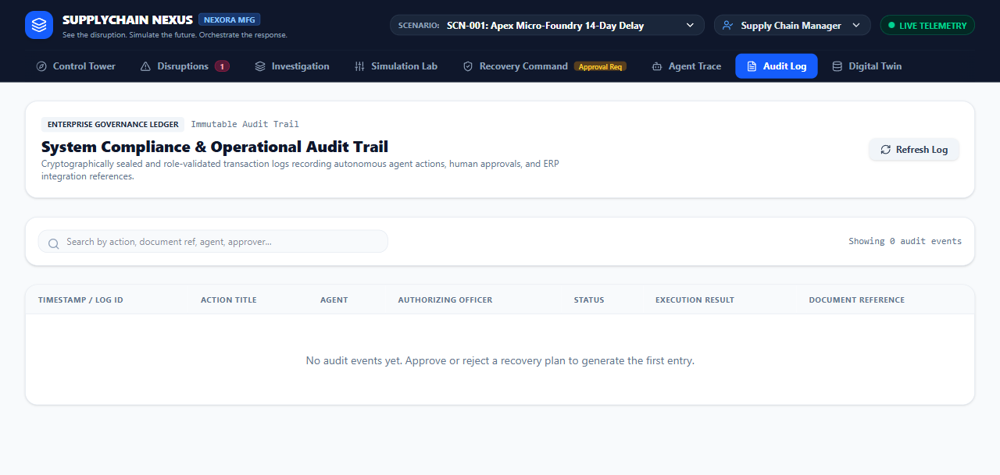
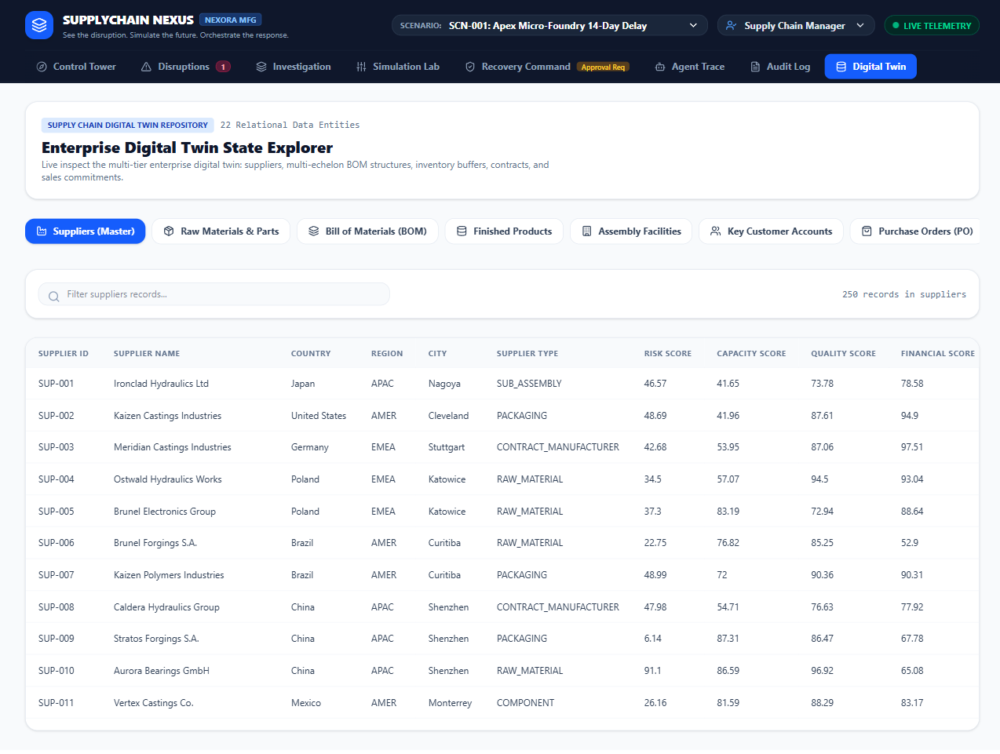

# SupplyChain Nexus

SupplyChain Nexus is an AI-powered resilience command center for manufacturing operations. It detects supplier disruption risk, quantifies its cascade across materials, plants, and customer orders, compares recovery strategies, and routes the final decision through a human approval gate before anything is executed.

The system pairs a **deterministic supply-chain engine** (impact math, simulation, recommendation — all pure Python, no model involved) with **four Microsoft Foundry prompt agents** that explain and reason over those verified numbers. The live demo tracks 5 independent disruption scenarios; the flagship scenario is a 14-day halt at supplier `SUP-042` (Apex Micro-Foundry), exposing $16.70M in revenue across 127 customer orders.

> **Live app:** https://supplychain-nexus-app.azurewebsites.net/
>
> **Course submission:** [Read the full solution design and production-readiness plan](submission.md)

## Why this matters

A supplier delay rarely stays local. One disruption event can cascade into:

- raw-material stockouts within days
- starved BOM components and stalled assembly lines
- missed Tier-1 customer SLAs with contractual penalty exposure
- millions of dollars in exposed revenue with no agreed response
- an unapproved, unaudited procurement decision made under pressure

SupplyChain Nexus turns that into a single operational workflow: **see it, simulate it, decide it, govern it** — with every number traceable back to a deterministic calculation and every action traceable back to a human approval.

## What the solution demonstrates

- A hosted Foundry orchestrator agent coordinating **four specialist prompt agents**, each with a single job and zero authority to invent numbers
- A deterministic digital twin and simulation engine — the model layer only explains figures that Python already computed
- Five recovery strategies (do nothing, expedite, reallocate inventory, alternate supplier, reschedule production) compared on cost, protection, delay, and SLA risk
- A financial approval gate: plans above `$250,000` (configurable) require an authorized human sign-off before execution
- A full execution trace (`TRACE-001`…`TRACE-006`) and an immutable audit log tying every action back to an agent, a user, and a document reference
- Five live disruption scenarios and four role-based personas (Supply Chain Manager, Executive VP Operations, MRP Production Planner, Procurement Lead)
- Microsoft Foundry deployment defined declaratively in `azure.yaml`

## Architecture at a glance



All five agents are deployed as Microsoft Foundry Prompt Agents in the `supplychain-nexus-dev` project: the hosted orchestrator (`supplychain-nexus`) plus four specialists (`nexus-impact-analyst`, `nexus-simulation-strategist`, `nexus-recovery-planner`, `nexus-compliance-officer`).

## Agent responsibilities — step by step

Every run executes the same six-step pipeline, and every step is recorded in the Agent Trace view (`TRACE-001` … `TRACE-006`). No specialist is allowed to calculate, estimate, or invent a number — each one is instructed to only restate figures that appear verbatim in the verified facts it receives.

| Step | Actor | What it actually does |
| --- | --- | --- |
| `TRACE-001` | **Orchestrator** — deterministic engine | Calls `calculate_supplier_impact()`: traverses supplier → material → BOM component → product → plant → customer order over the live digital twin and returns revenue at risk, orders at risk, affected plants, and inventory coverage days. |
| `TRACE-002` | **Orchestrator** — deterministic engine | Calls `simulate_strategies()`: scores all 5 recovery strategies (do nothing, expedite, reallocate inventory, alternate supplier, reschedule production) on revenue protected, additional cost, delay days, and customer SLA risk, then selects the recommended strategy by net benefit. |
| `TRACE-003` | **Impact Analyst** (`nexus-impact-analyst`) | Explains the blast radius in ≤4 sentences: leads with revenue at risk, affected customer orders, and inventory runway; names the constrained materials and plants. |
| `TRACE-004` | **Simulation Strategist** (`nexus-simulation-strategist`) | Compares the top recovery strategies' trade-offs (cost vs. protection vs. delay vs. SLA risk) in ≤4 sentences. Does **not** pick a winner — that's the Recovery Planner's job. |
| `TRACE-005` | **Recovery Planner** (`nexus-recovery-planner`) | Justifies why the engine-recommended strategy wins on net benefit, states its main risk, and lists the concrete actions required — in ≤5 sentences. |
| `TRACE-006` | **Compliance Officer** (`nexus-compliance-officer`) | States plainly whether human approval is required, which role must approve (Executive above the threshold; Supply Chain or Procurement Manager below it), and what must be recorded in the audit log — in ≤4 sentences. |
| — | **Human approval gate** | A Supply Chain Manager, Executive, or Procurement Manager reviews the plan in Recovery Command and approves or rejects it. Only an approval unlocks execution. |
| — | **Action / audit layer** | On approval, each recovery action (e.g. `ACTIVATE_ALTERNATE_SUPPLIER`, `TRANSFER_INVENTORY`, `RESCHEDULE_PRODUCTION`) is marked executed and logged with a timestamp, approver, role, and document reference (PO, transfer order, MRP schedule) in the immutable Audit Log. |

Every specialist is grounded with the same rule, defined once in `backend/scripts/create_agents.py`:

> "You never calculate, estimate, or invent numbers. Every figure you mention must appear verbatim in the VERIFIED FACTS supplied to you. If a number you need is absent, say it is unavailable rather than guessing."

### Why five agents instead of one

A single general-purpose agent would have to reason about graph traversal, numeric simulation, procurement trade-offs, and governance in one prompt — increasing the risk of hallucinated figures, unclear ownership, and an unauditable decision. Splitting the work gives:

- **Grounding** — decision-critical numbers come from Python, not the model
- **Testability** — each specialist can be evaluated independently (see `backend/scripts/local_agent_eval.py`)
- **Explainability** — every step has a typed input, output, latency, and reasoning note
- **Governance** — the Recovery Planner can only recommend; the approval gate controls execution

## Screenshot walkthrough

Screenshots below were captured directly from the live application.

### 1) Control Tower — operational overview



The landing view for the active disruption. It surfaces network health (72/100, −18 pts due to `SUP-042`), $16.70M revenue exposure across 127 orders, active disruption severity mix, peak supplier risk, and plants impacted (3 of 4: Stuttgart, Detroit, Yokohama) — plus an interactive global topology map of suppliers, plants, and the Rotterdam transshipment corridor.

### 2) Disruptions — live registry



A searchable, filterable registry of every active and historical disruption event (`EVT-2026-042` and others), each with type, impacted entity, severity, duration, estimated financial impact, and status — the entry point for investigating any individual event.

### 3) Investigation — root cause and cascade



An interactive dependency graph tracing the actual cascade: `SUP-042` → materials `MAT-1007`/`MAT-1012` → BOM components `COMP-204`/`COMP-205` → finished products (`PROD-5001`, `PROD-5004`, `PROD-5012`) → plants (`PLANT-03` Stuttgart, `PLANT-07` Detroit) → Tier-1 customers at SLA risk (Boeing, Siemens, Tesla). This is the digital twin made operationally useful: the exact chain behind the $16.70M exposure, not a generic summary.

### 4) Simulation Lab — recovery strategy comparison



All 5 deterministic recovery strategies scored side by side — revenue protected, execution cost, orders saved, delivery delay, and customer SLA risk — with financial payoff and delay/risk trade-off charts. In the flagship scenario, `ALTERNATE_SUPPLIER` protects $15.87M of $16.70M at risk for $185K, cutting delay to 2 days and SLA risk to 8%, versus `DO_NOTHING` at 89% SLA risk.

### 5) Recovery Command — plan and approval gate



The formal recovery plan (`REC-PLAN-2026-042`): $4.12M revenue protected against $192K additional cost (net payoff +$3.93M), a 4-step action plan (alternate-supplier PO, inter-plant inventory transfer, Tier-1 production reprioritization), the Recovery Planner's explainable rationale, and the contract clause grounding the alternate-sourcing decision. Nothing dispatches to ERP or transport systems until a human clicks **Request Approval**.

### 6) Agent Trace — explainable execution log



The full `TRACE-001`…`TRACE-006` execution log: which actor ran, which tool or Foundry agent was called, latency in milliseconds, a timestamp, a reasoning note, and the exact input/output payload exchanged with each Foundry specialist. This is what makes the system auditable rather than a black box — every specialist response shown here is reproduced verbatim from a real Foundry agent call, including token counts.

### 7) Audit Log — governance ledger



An immutable, searchable ledger of every executed or rejected action: timestamp, action title, requesting agent, authorizing officer, approval status, execution result, and document reference. Entries are created the moment a recovery plan is approved or rejected — nothing is logged speculatively.

### 8) Digital Twin — the underlying enterprise model



A live browser over the full twin dataset across 9 entity categories — suppliers, raw materials, BOM structures, finished products, assembly facilities, key customer accounts, purchase orders, customer orders, and supplier SLA contracts (e.g. 250 supplier records with risk, capacity, quality, and financial scores). This is the ground truth every agent response is checked against.

## End-to-end workflow

1. A disruption scenario is selected (or detected) and surfaces in the Control Tower.
2. The orchestrator runs the deterministic impact calculation (`TRACE-001`).
3. The orchestrator runs the deterministic strategy simulation and recommendation (`TRACE-002`).
4. The Impact Analyst, Simulation Strategist, Recovery Planner, and Compliance Officer each explain their slice of the verified facts (`TRACE-003`–`TRACE-006`).
5. The Recovery Command view presents the plan; a Supply Chain Manager, Executive, or Procurement Manager approves or rejects it.
6. Approved actions execute and are written to the immutable Audit Log with full traceability.

## Repository structure

| Path | Purpose |
| --- | --- |
| `src/` | React control-tower UI (Control Tower, Disruptions, Investigation, Simulation Lab, Recovery Command, Agent Trace, Audit Log, Digital Twin) |
| `backend/app/main.py` | FastAPI routes: dashboard, scenarios, impact, recovery plan approval/rejection, audit log |
| `backend/app/orchestrator.py` | Runs the DETECT → SIMULATE → DECIDE → GOVERN pipeline and records every trace step |
| `backend/app/agent.py` | Foundry Responses-protocol adapter for the hosted orchestrator agent and its tools |
| `backend/app/impact.py` | Deterministic supplier → material → BOM → product → plant → order impact calculation |
| `backend/app/simulation.py` | Deterministic recovery-strategy simulation and recommendation logic |
| `backend/app/workflow.py` | Recovery plan lifecycle: actions, approval, rejection, audit logging |
| `backend/app/twin.py` / `domain.py` | Digital twin data model and loader |
| `backend/scripts/create_agents.py` | Creates the four Foundry specialist prompt agents with their grounded instructions |
| `backend/scripts/local_agent_eval.py` | Domain-grounded evaluation harness for the specialist agents |
| `backend/tests/` | Automated tests for impact, simulation, workflow, agent, and connection logic |
| `azure.yaml` | Microsoft Foundry model deployment and hosted-agent configuration |
| `docs/screenshots/` | Screenshots used in this README |
| `submission.md` | Full course submission and production-readiness narrative |

## Local setup

Install the web dependencies:

```powershell
npm install
```

Run the frontend:

```powershell
npm run dev
```

Run the Python API in a second terminal:

```powershell
cd backend
python -m pip install -r requirements.txt
python -m uvicorn app.main:app --reload --port 8000
```

The frontend communicates with the backend routes. For Foundry Responses-protocol integration, configure `AZURE_AI_PROJECT_ENDPOINT` and `AZURE_AI_MODEL_DEPLOYMENT_NAME`, authenticate with an Azure identity that can invoke the project's model deployment, then create the four specialist agents once:

```powershell
cd backend
python -m scripts.create_agents
```

## Deploying to Microsoft Foundry

```powershell
azd auth login
azd up
```

`azure.yaml` provisions the Foundry project, deploys the `gpt-4.1-mini` model, and hosts the orchestrator agent (`supplychain-nexus`) with the Responses protocol. Run `scripts/create_agents.py` once against the provisioned project to register the four specialist prompt agents.

## Validation

```powershell
npm run lint
npm run build:web
cd backend
python -m pytest
```

The prototype is intentionally grounded in deterministic calculation for business-critical outputs. Specialist agents explain and coordinate; they never compute revenue exposure, inventory coverage, or recovery economics themselves.

## Solution positioning

SupplyChain Nexus is a realistic example of a controlled, production-oriented AI system for operations:

- grounded in actual domain data and deterministic logic, not model estimation
- built for human oversight, with a real approval gate before execution
- explainable at every step — trace, audit, and tool payloads are all inspectable
- extensible to ERP, MRP, procurement, and logistics integrations without rewriting the impact engine

## Data protection note

The scenario data in this repository is illustrative. Do not add confidential supplier records, personal information, customer-sensitive information, internal contracts, screenshots, or logs to public documentation or presentation material. Replace or redact operational identifiers before sharing the submission externally.

