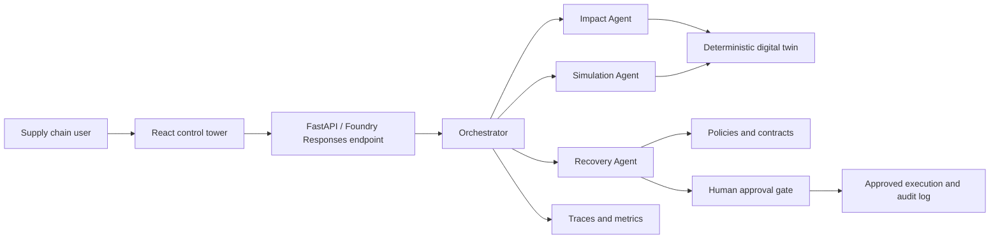

# SupplyChain Nexus

SupplyChain Nexus is a production-oriented multi-agent concept for responding to supplier disruptions before they become plant stoppages, missed customer commitments, and uncontrolled financial exposure.

The solution combines a Microsoft Foundry hosted agent with a deterministic supply-chain digital twin, recovery simulations, human approval gates, audit history, and an operational control-tower interface. The current scenario models a 14-day disruption at supplier `SUP-042` and traces its effect across materials, bills of material, products, plants, and customer orders.

> **Course submission:** [Read the complete solution design and production-readiness plan](submission.md)

## What It Demonstrates

- A multi-agent workflow with distinct impact, simulation, and recovery responsibilities
- Tool-grounded answers: financial and operational figures come from deterministic functions, not model guesses
- A digital-twin view of supplier, material, BOM, product, plant, and order relationships
- Five recovery strategies compared before a recommendation is made
- Human-in-the-loop approval for actions above the autonomous execution threshold
- Trace, audit, and workflow views for diagnosis and operational accountability
- A Microsoft Foundry deployment definition in `azure.yaml`

## Architecture At A Glance



## Repository Structure

| Path | Purpose |
| --- | --- |
| `src/` | React control-tower experience and workflow views |
| `server/` | Local orchestration, digital twin, simulation, trace, and audit models |
| `backend/app/` | FastAPI service and Microsoft Foundry Responses-protocol adapter |
| `backend/tests/` | Tests for impact, simulation, workflow, agent, and connection behavior |
| `azure.yaml` | Foundry project, model deployment, and hosted-agent configuration |
| `submission.md` | Full course submission document |

## Run Locally

Install the web dependencies:

```powershell
npm install
```

Run the frontend:

```powershell
npm run dev
```

Run the Python API in a second terminal:

```powershell
cd backend
python -m pip install -r requirements.txt
python -m uvicorn app.main:app --reload --port 8000
```

The frontend uses the API routes exposed by the backend. For Foundry Responses-protocol calls, configure `AZURE_AI_PROJECT_ENDPOINT` and `AZURE_AI_MODEL_DEPLOYMENT_NAME`, then authenticate with an Azure identity that can invoke the project model deployment.

## Validate The Prototype

```powershell
npm run lint
npm run build:web
cd backend
python -m pytest
```

The application is intentionally grounded in deterministic calculations for decision-critical values. The language model explains results and coordinates tools; it does not invent revenue exposure, inventory coverage, or recovery economics.

## Data Protection Note

The scenario data in this repository is illustrative. Do not add confidential supplier records, personal information, customer-sensitive data, internal contracts, screenshots, or traces to public documentation or presentation material. Replace or redact any real operational identifiers before sharing the submission.
