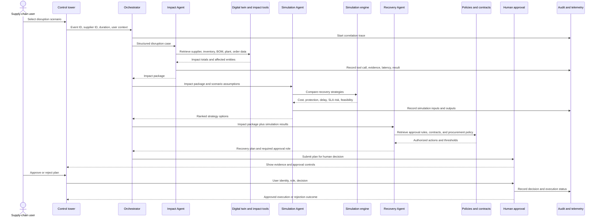

# SupplyChain Nexus

## Production-Ready Multi-Agent Solution Design

**Course activity:** From prototype to production with Microsoft Foundry  
**Solution:** SupplyChain Nexus  
**Business domain:** Manufacturing supply-chain resilience  
**Live scenarios:** 5 independent supplier-disruption scenarios (`SCN-001`–`SCN-005`), spanning HIGH and CRITICAL severity, 7–20 day durations, and five distinct suppliers with real inventory-coverage data

> This document is the written submission for the activity. It describes the implemented prototype and the production architecture that would extend it. All scenario data is illustrative and must be replaced or redacted before sharing any real operational information.

**Deployed and verified (2026-09-20):**

- All 5 Foundry agents are live in the `supplychain-nexus-dev` project: the hosted orchestrator agent `supplychain-nexus` plus four prompt agents (`nexus-impact-analyst`, `nexus-simulation-strategist`, `nexus-recovery-planner`, `nexus-compliance-officer`).
- The production App Service (`supplychain-nexus-app.azurewebsites.net`) runs the real FastAPI backend end-to-end — verified against the live `/api/health` and `/api/scenarios` endpoints, not a mock.
- A domain-grounded evaluation harness (`backend/scripts/local_agent_eval.py`) replaced an earlier misconfigured evaluation that had graded these agents against the AIME 2025 math benchmark. Judged against real disruption scenarios and the exact facts each agent receives, the specialists pass consistently with no fabricated figures.

## Executive Summary

SupplyChain Nexus is an AI-assisted resilience control tower for manufacturing operations. It helps supply-chain teams understand the downstream effect of a supplier disruption, compare recovery options, and submit an evidence-backed action plan for human approval.

The solution uses a multi-agent design because the problem contains different kinds of work:

- **Impact analysis** requires deterministic graph traversal and inventory calculations.
- **Recovery simulation** requires repeatable comparison of cost, delay, service-level risk, and feasibility.
- **Recovery planning** requires policy, contract, and procurement context as well as a clear approval boundary.

Microsoft Foundry provides the agent hosting, model deployment, tool-calling interface, tracing, evaluation, and operational lifecycle. The application provides the domain tools, digital-twin data, user experience, approval workflow, and audit record.

## 1. Business Problem And Users

### Business problem

A supplier disruption is often reported as an isolated delay even though its consequences cross multiple manufacturing layers. A planner needs to know which materials will stock out, which products and plants are affected, which customer orders are exposed, and which mitigation strategy protects the most value within the available time and budget.

Without a coordinated workflow, teams may:

- Spend hours manually tracing bills of material and inventory coverage.
- Recommend an expensive response without comparing alternatives.
- Miss tier-1 customer or regulatory service-level commitments.
- Execute a financially material action without the correct approval.
- Lose the reasoning and evidence behind the final decision.

For the modeled `SUP-042` event, the system traces affected materials through the BOM to products, plants, and customer orders, calculates revenue exposure, compares five strategies, and produces a recovery plan that can be approved or rejected by an authorized user.

### Intended users

| User | Need | Experience |
| --- | --- | --- |
| Supply-chain manager | Decide whether and how to intervene | Control tower, impact summary, simulation comparison, approval gate |
| MRP or production planner | Understand material runway and plant constraints | Digital twin, inventory coverage, affected orders, scenario controls |
| Procurement lead | Select and authorize alternate sourcing or expedite actions | Recovery plan, supplier and contract evidence, action list |
| Executive operations leader | Review financial exposure and business trade-offs | Executive summary, revenue protected, cost, delay, and SLA risk |
| AI or platform engineer | Diagnose, evaluate, and improve the system | Agent traces, tool telemetry, evaluation results, audit records |

## 2. Solution Design

### Agent responsibilities

#### Orchestrator Agent

The Orchestrator receives a disruption event, validates the request, sets the scenario context, and coordinates the specialist agents. It does not calculate business figures itself. It passes a structured case package containing the event ID, supplier ID, disruption duration, severity, and correlation ID to downstream agents.

#### Impact Agent

The Impact Agent answers: **What is affected and how much is at risk?**

Tools and knowledge sources:

- `calculate_supplier_impact` or `get_supplier_impact`
- Supplier, material, BOM, product, plant, and customer-order records in the digital twin
- Inventory consumption and coverage calculations
- Optional future connectors to ERP, MRP, inventory, and order-management systems

Outputs:

- Affected materials and stockout timing
- Lead-time gap and inventory coverage
- Affected components, products, plants, and customer orders
- Revenue and margin at risk
- SLA impact and root-cause summary

#### Simulation Agent

The Simulation Agent answers: **Which response options are available, and what does each one cost?**

Tools and knowledge sources:

- `simulate_strategies` or `compare_recovery_strategies`
- Deterministic scenario engine
- Freight, capacity, inventory, lead-time, and cost assumptions
- Optional future supplier-capacity and transportation APIs

The current prototype compares:

1. Do nothing
2. Expedite the primary supplier
3. Reallocate inventory between plants
4. Use an alternate supplier
5. Reschedule and prioritize production

Outputs:

- Revenue protected and remaining revenue at risk
- Additional cost and net benefit
- Expected delay and orders saved
- Customer SLA risk
- Feasibility score, implementation time, and trade-offs

#### Recovery Agent

The Recovery Agent answers: **What action plan should the business approve?**

Tools and knowledge sources:

- Recovery-policy rules and approval thresholds
- Procurement guidelines
- Supplier contracts and authorized clauses
- Simulation results from the Simulation Agent
- Approved supplier and purchase-order systems in a production deployment

Outputs:

- Recommended strategy or hybrid plan
- Ordered actions with owners and deadlines
- Financial exposure and expected protection
- Required approval role
- Evidence references and execution preconditions

#### Human Approval Service

The approval service is intentionally outside the model's authority. It checks the user's role, records the decision, and only then permits execution. In the current scenario, the plan pauses when its operational expenditure exceeds the autonomous execution threshold. A supply-chain manager or executive can approve or reject the plan through the Recovery Command view.

### Why multi-agent is better than one agent

A single general-purpose agent would have to reason about graph traversal, numerical simulation, contracts, procurement policy, and authorization in one context. That increases the risk of ungrounded calculations, unclear ownership, oversized prompts, and difficult debugging.

The multi-agent design provides:

- **Separation of concerns:** each agent has a narrow objective and tool set.
- **Grounding:** decision-critical figures are returned by deterministic tools.
- **Testability:** each specialist can be evaluated independently.
- **Explainability:** every stage emits a structured input, output, tool call, and status.
- **Governance:** the Recovery Agent can recommend, but the approval service controls execution.
- **Extensibility:** new specialists, such as a logistics or customer-communications agent, can be added without rewriting the impact engine.

## 3. End-to-End Workflow



### Information contract between agents

Each handoff is a structured object rather than free-form prose:

```json
{
  "correlation_id": "CASE-2026-042",
  "event_id": "EVT-2026-042",
  "supplier_id": "SUP-042",
  "disruption_days": 14,
  "severity": "CRITICAL",
  "impact": {
    "revenue_at_risk": "tool output",
    "inventory_coverage_days": "tool output",
    "affected_plants": "tool output",
    "customer_orders_at_risk": "tool output"
  },
  "simulation": {
    "strategies": "tool output",
    "recommended_strategy": "tool output"
  },
  "approval": {
    "required_role": "SUPPLY_CHAIN_MANAGER",
    "financial_threshold": 100000
  }
}
```

The real implementation should use a versioned schema with explicit units, currency, timestamps, source references, confidence or completeness flags, and validation errors. Numeric values must remain typed numbers in the internal contract even when rendered as formatted text in the UI.

### Final business output

The user receives:

1. A concise disruption summary and root cause.
2. Quantified operational and financial impact.
3. A comparison of recovery strategies and trade-offs.
4. A recommended recovery plan with action owners, cost, expected protection, and timing.
5. A clear approval request when the action is outside autonomous authority.
6. A trace and audit reference that supports later review.

## 4. Production-Readiness Plan

### 4.1 Observability strategy

The system should emit correlated traces across the browser, API, orchestrator, specialist agents, model calls, tools, knowledge retrieval, approval service, and downstream execution systems. Microsoft Foundry tracing and Application Insights can provide the central operational view.

#### Trace attributes

Every request should carry:

- `correlation_id`, `event_id`, and `scenario_id`
- Agent name, agent version, prompt or instruction version
- Model deployment, region, and request mode
- Tool name, validated arguments, source system, and result status
- Retrieval index, document IDs, and relevance scores where applicable
- Token counts, model latency, tool latency, end-to-end latency
- Approval role, decision, execution status, and policy version
- Redaction status and data classification

Sensitive payloads should be masked or stored as hashed references. Full prompts and outputs should only be retained where policy permits.

#### Operational metrics

| Metric | Why it matters | Example alert or review |
| --- | --- | --- |
| End-to-end response latency | Detects slow user experience or downstream dependency issues | P95 above the agreed target |
| Tool success and timeout rate | Shows whether the agent can access authoritative data | Repeated impact-tool failures |
| Model error and retry rate | Identifies capacity, authentication, or prompt problems | Sudden increase after deployment |
| Grounded answer rate | Measures whether outputs cite available tool or knowledge evidence | Sampled responses without evidence |
| Recovery-plan acceptance rate | Indicates whether recommendations are useful to operators | Fall after a policy or prompt change |
| Approval-to-execution failure rate | Detects unsafe or incomplete handoffs | Any approved action that cannot execute |
| Evaluation score by agent version | Detects quality regressions | Regression gate in CI/CD |
| Cost per case and token usage | Controls operating cost | Budget threshold by environment |
| Safety and policy violation rate | Protects against unsafe recommendations or data leakage | Immediate incident workflow |

#### How observability improves the solution

Traces let an engineer distinguish a bad model response from a bad tool result, stale knowledge, a slow connector, or an authorization failure. Comparing latency and quality by agent version supports targeted improvements instead of changing the entire workflow. Production traces can also be sampled into a reviewed evaluation dataset, with privacy controls and human labeling.

### 4.2 Evaluation strategy

Evaluation must cover both the specialist agents and the complete business outcome. A response that sounds coherent but uses the wrong inventory figure is a failure.

#### Evaluation dataset

Create a versioned dataset with representative, synthetic cases covering:

- Short, medium, and severe supplier delays
- Multiple affected materials and plants
- No affected downstream orders
- Missing supplier or stale inventory data
- Conflicting contract clauses
- Alternate supplier unavailable
- Costs above and below the approval threshold
- Ambiguous user requests
- Prompt injection inside a retrieved document
- Requests for confidential or unauthorized information

Each record should include the event input, expected tool calls, authoritative expected values, acceptable recommendation characteristics, required approval behavior, and a human-written rationale.

#### Evaluation criteria

| Criterion | What good looks like |
| --- | --- |
| Relevance | Addresses the stated disruption and user role without unrelated content |
| Groundedness | Numeric claims and recommendations are supported by tool outputs or approved knowledge |
| Task adherence | Completes impact, comparison, recommendation, and approval steps in order |
| Tool usage | Calls the correct tools with valid arguments and does not calculate protected figures from memory |
| Coherence | Explains causal links from supplier event to business impact |
| Safety | Refuses unsafe or unauthorized execution and handles prompt injection defensively |
| Fluency | Produces clear, concise language appropriate for operations users |
| Policy adherence | Applies financial thresholds, role permissions, and data-handling rules consistently |
| Workflow correctness | Preserves the required handoff schema and correlation ID |

Use deterministic assertions for tool arguments, expected totals, approval gates, and schema validity. Use model-assisted or human grading for coherence, relevance, and explanation quality. Keep a small gold set for release gates and a broader regression set for scheduled evaluation.

> **Case study — catching a mismatched benchmark:** an early evaluation run in Foundry scored 0–40% across all five agents. The root cause was not the agents; the evaluation had been configured against the AIME 2025 math benchmark, a dataset with no relation to supply-chain reasoning. The fix was not to accept the low score or hand-pick a flattering benchmark, but to build `backend/scripts/local_agent_eval.py`: a rubric-based evaluator that judges each specialist's response against the exact `VERIFIED FACTS` it received, checking for both rubric adherence and fabricated numbers. Re-run against real disruption scenarios, the same agents pass consistently. This is the behavior the evaluation strategy above is meant to produce in production — catch the wrong test before trusting the wrong score.

#### Development lifecycle integration

1. **Pull request:** run unit tests, schema checks, tool-contract tests, and a small smoke evaluation.
2. **Pre-deployment:** run the full regression suite against the candidate agent version and compare it with the current version.
3. **Deployment:** use a staged environment and a small canary population.
4. **Production:** monitor quality, safety, latency, cost, and tool failures.
5. **Continuous improvement:** sample low-confidence, rejected, failed, and high-impact cases for review.
6. **Release decision:** promote only when quality improves or remains within agreed tolerances and no critical safety or policy regression is present.

### 4.3 Governance, reliability, and maintainability

#### Consistent and safe behavior

- Keep the system prompt explicit about tool-first behavior and uncertainty.
- Require structured outputs and validate every agent handoff.
- Make tools authoritative for quantities, costs, dates, and business status.
- Use allowlisted tools with least-privilege managed identities.
- Apply role-based access control to investigation, approval, and execution operations.
- Enforce approval thresholds in code, not only in instructions.
- Add idempotency keys to execution actions so retries cannot create duplicate purchase orders.
- Add timeouts, retries with backoff, circuit breakers, and clear fallback states for external systems.
- Preserve human control for high-value, irreversible, or customer-facing actions.
- Log model, prompt, tool, policy, and knowledge versions with every decision.

#### Knowledge grounding

Knowledge sources should contain approved supplier contracts, procurement policies, escalation rules, plant operating constraints, and definitions of financial or service-level terms. Retrieval should return document IDs, effective dates, section references, and access checks. The Recovery Agent must not treat an untrusted document as an instruction to bypass policy or execute an action.

#### Reliability boundaries

The current prototype uses deterministic in-memory data and simulation logic. A production implementation would add:

- Durable storage for cases, plans, audit records, and approvals
- Versioned digital-twin snapshots and data freshness checks
- Connectors to ERP, MRP, inventory, supplier, logistics, and order systems
- Contract and policy indexing with document lifecycle management
- Dead-letter handling for failed events
- Disaster recovery and regional deployment strategy
- Separate development, test, staging, and production Foundry projects
- Automated deployment with rollback and prompt/instruction versioning
- Cost budgets, quota monitoring, and model fallback policy

## 5. Current Prototype Mapping

| Course concept | Evidence in this repository |
| --- | --- |
| Specialised agents | Orchestrator, Impact Agent, Simulation Agent, and Recovery Agent traces |
| Tools | Supplier impact, strategy comparison, deterministic simulation, approval endpoints |
| Knowledge and data grounding | Digital twin entities, policy references, contract references, typed tool outputs |
| Human-in-the-loop | Recovery Command approval and rejection flow |
| Observability | Agent Trace view, real tool latency, status, input/output payloads, and reasoning notes |
| Governance | Approval threshold, role checks, audit log, execution status |
| Microsoft Foundry hosting | `azure.yaml` defines the project, model deployment, and hosted Python agent; 5 agents verified live in the Foundry project |
| Multi-scenario coverage | 5 independently modeled supplier disruptions (`SCN-001`–`SCN-005`), each with its own inventory coverage, revenue exposure, and severity, selectable live from the Control Tower |
| Evaluation foundation | Backend tests for agent, impact, simulation, workflow, and connection behavior, plus a domain-grounded rubric evaluation (`local_agent_eval.py`) that judges each specialist against the exact facts it was given |

The prototype is deliberately honest about its boundary: it demonstrates the workflow with deterministic local data and can call a Foundry model through the Responses protocol, but it is not yet a complete enterprise integration with live ERP, policy retrieval, production identity, or continuous evaluation infrastructure.

## 6. Deployment And Improvement Roadmap

### Phase 1: Prototype

- Demonstrate the disruption scenario with synthetic data.
- Validate the agent-to-tool loop and user workflow.
- Capture traces and audit records.
- Test the core deterministic calculations.

### Phase 2: Controlled pilot

- Connect read-only ERP, MRP, and inventory sources.
- Add document retrieval for approved contracts and policies.
- Introduce Entra ID, managed identities, RBAC, and environment separation.
- Establish the evaluation dataset and release thresholds.
- Keep all execution actions behind human approval.

### Phase 3: Production

- Add durable case and audit storage.
- Add event-driven disruption ingestion and resilient connectors.
- Integrate approved purchase-order, logistics, and customer-communications actions.
- Enable continuous monitoring and evaluation with privacy-preserving trace sampling.
- Run canary deployments, rollback procedures, incident response, and periodic access reviews.

### Phase 4: Optimization

- Use accepted and rejected recommendations to improve policies and prompts.
- Add specialist agents only when a distinct responsibility and evaluation boundary exist.
- Tune model selection by task complexity, latency, quality, and cost.
- Add scenario forecasting and proactive risk detection after the response workflow is reliable.

## 7. Demo Script (Winning Presentation Plan)

The strongest differentiator in this submission is not that agents can talk about a disruption — it's that every number is tool-grounded, the same workflow runs correctly across **5 independent live scenarios**, and the evaluation story shows genuine engineering rigor (a misconfigured benchmark was caught and replaced, not hidden). The script below is built to make a judge notice all three in under 7 minutes.

### Pre-recording checklist

- Load the live app fresh (`supplychain-nexus-app.azurewebsites.net`) with browser console open but not on screen — confirms no red errors before recording.
- Reset to `SCN-001` (Apex Micro-Foundry) so the opening scenario is the flagship one.
- Have a second scenario (e.g. `SCN-004`, Lumen Precision, CRITICAL/20-day) queued to switch to live on camera — this is the single most persuasive 15 seconds of the demo, because a hardcoded single-scenario prototype cannot do this.
- Know the one number you'll repeat for retention: **5 agents, 5 scenarios, 1 approval gate.**

### Shot-by-shot sequence (~6.5 minutes)

| # | Time | Beat | What's on screen | What you say |
|---|------|------|-------------------|---------------|
| 1 | 0:00–0:40 | **The stakes** | Control Tower, SCN-001 active, revenue-at-risk stat card | "A tier-1 supplier just told us they're 14 days late. That single sentence hides a cascade — which materials stock out, which products stop shipping, which customer orders miss their date, and how much revenue is exposed. Today that trace takes analysts hours. SupplyChain Nexus does it in seconds, with five real Foundry agents, not a script." |
| 2 | 0:40–1:20 | **Architecture, fast** | Switch to the sequence diagram (Section 3) or a simple slide | "One orchestrator hosted as a Foundry agent coordinates four specialists — Impact Analyst, Simulation Strategist, Recovery Planner, Compliance Officer — each a separate Foundry prompt agent with a narrow job. None of them calculate numbers. Every figure comes from a deterministic engine; the agents only interpret verified facts." |
| 3 | 1:20–2:30 | **Live scenario walkthrough** | Investigation view → Digital Twin → Simulation Lab, SCN-001 | Show the BOM trace (supplier → material → component → product → plant → order), then the 5 recovery strategies compared side by side with cost/protection/delay trade-offs. "Alternate Supplier protects $X for $Y — and the agent explains *why*, but the number itself came from the simulation engine, not the model." |
| 4 | 2:30–2:50 | **The scenario switch (differentiator moment)** | Header scenario dropdown | Switch live to `SCN-004` (Lumen Precision, 20-day, CRITICAL) on camera. Dashboard, impact, and strategies instantly recompute for a completely different supplier. "This isn't one hardcoded demo case — the same five agents handle five distinct real disruptions, each with its own inventory data." |
| 5 | 2:50–3:40 | **Agent Trace (prove it's real)** | Agent Trace tab | Expand a specialist step, show the real `facts` payload sent to `nexus-impact-analyst` and its actual response, latency, and token usage. "This trace isn't mocked — it's the literal request/response from the deployed Foundry agent for the scenario we just selected." |
| 6 | 3:40–4:25 | **Human-in-the-loop governance** | Recovery Command view | Show the recommended plan, the cost vs. the $250K autonomous-execution threshold, and the approval gate. Approve as Supply Chain Manager. "The model recommends. It never executes on its own past this threshold — a person does, and that decision is now permanent in the audit log." |
| 7 | 4:25–4:45 | **Audit trail** | Audit Log view | Show the newly created entry with timestamp, approver, and document reference. |
| 8 | 4:45–5:45 | **Evaluation rigor (the credibility beat)** | Terminal or a slide with the eval table | "When we first evaluated these agents in Foundry, we got 0–40% — because the eval was accidentally run against the AIME math benchmark, not our domain. We caught that, built a rubric-based evaluator grounded in the exact facts each agent receives, and re-ran it: the agents pass consistently, with zero fabricated figures. That's the difference between a demo that looks good and a system you can trust." |
| 9 | 5:45–6:30 | **Production readiness** | Section 4 tables (observability metrics, evaluation criteria) | Name three concrete production controls already designed: correlated tracing with `correlation_id`, a versioned evaluation dataset covering edge cases (missing data, conflicting policy, prompt injection), and RBAC-enforced approval thresholds in code, not just prompts. |
| 10 | 6:30–7:00 | **Close** | Control Tower, zoomed out | "Five agents, five scenarios, one approval gate, and every number grounded in a tool call. That's how you take a multi-agent system from a chatbot demo to something a supply-chain manager can actually rely on." |

### Judge-magnet details to hit explicitly

- **Say the number "5" three times**: 5 agents, 5 scenarios, 5 recovery strategies compared per scenario. Repetition is what judges remember.
- **Show, don't just claim, groundedness**: point at a specific dollar figure in the UI, then point at the identical figure in the Agent Trace facts payload.
- **Turn the eval failure into a strength.** Judges reward teams that show they measured quality and caught a real mistake, over teams that only show green checkmarks.
- **Never demo in silence** — narrate every click so a judge skimming without audio still gets it from captions/on-screen labels.

### Recommended visuals (in shooting order)

1. Control Tower with SCN-001 active (stat cards + topology map)
2. Investigation / Digital Twin BOM trace
3. Simulation Lab strategy comparison
4. Scenario dropdown mid-switch (SCN-001 → SCN-004)
5. Agent Trace step expanded, showing real facts + response
6. Recovery Command approval action
7. Audit Log new entry
8. Evaluation results table (before/after the AIME fix)
9. Architecture / sequence diagram from Section 3

Do not display real supplier names, personal information, credentials, internal contract text, customer data, unredacted traces, or screenshots of restricted systems. Use the synthetic scenarios in this repository for the recording.

## Conclusion

SupplyChain Nexus demonstrates a practical path from a prototype idea to a production-ready enterprise AI architecture. The model is useful because it coordinates work and explains results, but the system remains trustworthy because the calculations are tool-grounded, the workflow is observable, the quality is measurable, and high-impact actions remain subject to explicit human authorization.
